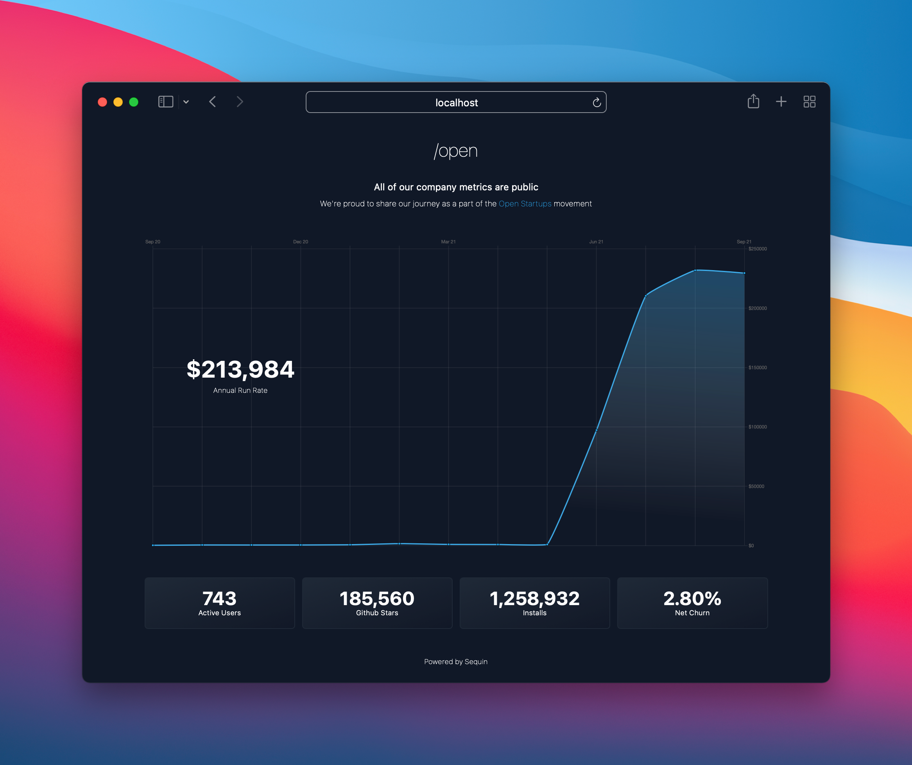

<p align="center">
  <a href="https://sequin.io/">
    
  </a>
</p>

# `/open`

Add an open page to your website in a few minutes. Share your revenue, KPIs, and progress to engage your community, build transparency, and foster trust.



> The design of the template is inspired by [ghost's `/open` page](https://ghost.org/open/) 👻

Built using Next.js and Sequin - you can connect this `/open` template directly to your Stripe data and deploy it to your website using Vercel. This page is completely static, so it loads instantly.

## Getting started

This `/open` page pulls revenue and KPI data directly from Stripe and Airtable using Sequin. First, you'll setup your data sources, then you'll spin up the page.

### Setup Stripe

You'll securely connect to your Stripe data using Sequin. Here is a brief overview, but if you need more detail you can [read a step-by-step guide here](https://docs.sequin.io/stripe/setup).

1. Create a [Sequin account](https://app.sequin.io/signup).
2. Create a new Stripe sync and enter your Stripe credentials.
3. **Click Create**. Sequin will provision a database for you on AWS and begin syncing your Stripe data.

> If you would prefer, you can [sync your Stripe directly to your database](https://docs.sequin.io/self-hosted).

### Setup Airtable

You'll use Airtable as a simple CMS to manage your metrics and KPIs. You'll then connect to your Airtable metrics using Sequin:

1. Create a free Airtable account. Then, [add the /Open base template](https://airtable.com/shrcI92uikjA5136B/tbluMQshnyboxaQsf/viwDTw4493yL0tvPW) to your workspace by clicking **Copy Base** in the top right corner.
2. In the `/Open` base template you just duplicated to your workspace, add your KPIs and metrics.
3. Now, sync your Airtable data to the same Sequin database that contains your Stripe data:
   * Go to the [Sequin Console](https://app.sequin.io/) and click **Add Sync**.
   * Select Airtable as your source, enter your Airtable API key, and choose your `/Open` base.
   * In the destination section, click **Change** and select **Choose Existing**. Click **Select** next to the database that contains your Stripe data and name the schema `airtable`.
   * Click to confirm the changes, and then click the **Create** button.

Sequin will now sync your Airtable data into the `airtable` schema in your Sequin database.

### Setup `/open`

With your data setup, you can spin up your `/open` page:

1. Clone this repo.
2. Add a `.env.local` file to the root of the directory and paste in the following environment variables, replacing the placeholders with the credentials for your Sequin database.

   ```plain
    PG_PASSWORD = {{YOUR_DB_PASSWORD}}
    PG_HOST = {{YOUR_DB_HOST}}
    PG_USER = {{YOUR_DB_USE}}
    PG_DATABASE = {{YOUR_DB_NAME}}
    PG_PORT = 5432
   ```

   > You  an always find your database credentials by going to the [Sequin Console](https://app.sequin.io/) and clicking the **Connect** button on your sync.

3. Install the dependencies by running `yarn` then launch the app by running `yarn dev` and opening `http://localhost:3000` in your browser.

You're `/open` page should load with your revenue metrics and KPIs.

## Next steps

From here, customize your page to your liking and deploy to production:

### Customize the metrics

All your revenue metrics are generated in the `lib/metrics.js` file. Out of the box, we provide queries to calculate MRR and ARR by month and by day for standard SaaS business models. You can adjust these queries to match your business needs. File a PR or Issue if you see ways to improve!

To adjust your KPIs, just update the Airtable base.

### Customize the Look

Use [Tailwind CSS](https://tailwindcss.com/) to customize the look and feel of your page.

Use [Chart JS](https://www.chartjs.org/) to adjust the graphs.

### Deploy

When you are ready to deploy, use Vercel or Netlify to set up your `/open` domain and page.

## Getting help

If you need any support, please reach out to <a href="founders@sequin.io">founders@sequin.io</a>.

## Learn more

Learn more about the `/Open` startup movement:

* https://openstartup.tm/
* https://www.openstartups.net/
